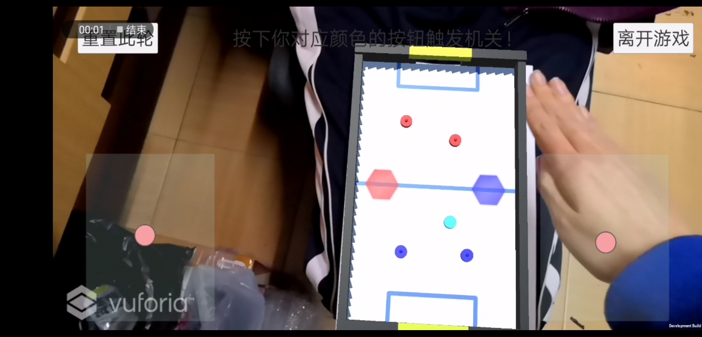

## Introduction

AR-Hockey is an exciting AR game inspired by the ice hockey game popular at gamerooms. Now, you no longer need to go to gameroom for the experience. Just print out the magic image below and scan it using our App, a virtual hockey table will be shown.

Watch the video for more details:

<video id="player" style="margin:auto; height:480px;" controls  preload>
  <source src="https://github.com/blmoistawinde/AR-Hockey/raw/master/webpage_files/demo.mp4" type="video/mp4" >
</video>
if you can't watch this on your browser, try download this.[video.mp4](https://github.com/blmoistawinde/AR-Hockey/raw/master/webpage_files/demo.mp4)

## Download

[V0.1-alpha](https://github.com/blmoistawinde/AR-Hockey/releases/download/0.1-alpha/AR-Hockey-V0.1-alpha.apk)

## How to play

1. At the menu, enter your nickname and press 'Start'.

2. Find the table image in your camera vision

3. After both you and your opponent have entered the room. Use the joystick to control the handles and hit the ball into your opponent's goal!

4. You will score when you've successfully hit the ball into your opponent's goal. And the one who scored 7 first won the game.

5. Pay attention to randomly appeared buttons, and press them immediately! They may grant you a special advantage.

6. Having fun!

